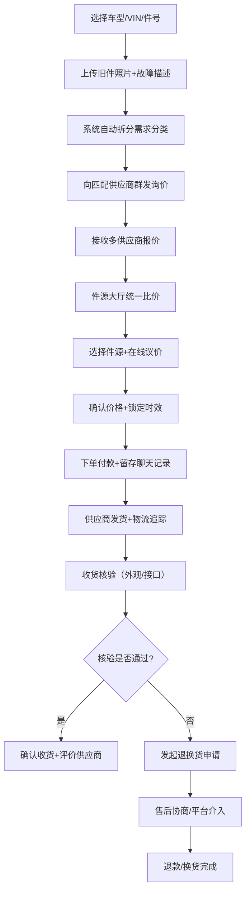

## 1. 产品概述

面向独立汽修厂和快修门店的Web询价交易平台，解决"同一辆车、同一个故障、配件来源杂、价格乱、到货慢"的行业痛点，提升配件采购效率与透明度。

- 目标用户：独立汽修厂、快修门店的采购人员与维修技师
- 核心价值：统一比价、透明溯源、高效议价、物流可追踪、售后有保障

## 2. 核心功能

### 2.1 用户角色

| 角色 | 注册方式 | 核心权限 |
|------|----------|----------|
| 采购方（汽修厂） | 手机号+营业执照 | 发起询价、浏览件源、下单采购、售后维权、评价供应商 |
| 供应商（拆车商） | 手机号+商户资质 | 发布件源、接收报价、处理订单、售后响应、查看评价 |

### 2.2 功能模块

1. **询价单页面**：发起询价、车型/VIN/原厂件号录入、旧件照片上传、故障描述、自动拆分配件类型
2. **件源大厅页面**：多供应商报价对比、成色/里程/质保筛选、拆车件实拍展示、拆解车辆信息
3. **供应商页面**：供应商资质展示、件源列表、历史评价、响应速度、履约率统计
4. **订单页面**：议价记录、补差管理、物流追踪、聊天记录留存、承诺记录
5. **售后页面**：外观/接口核验、异常件退换、售后进度追踪、退款管理

### 2.3 页面详情

| 页面名称 | 模块名称 | 功能描述 |
|----------|----------|----------|
| 询价单页面 | 车型信息录入 | 支持品牌/车系/年款选择、VIN码解析、原厂件号搜索 |
| 询价单页面 | 故障描述模块 | 文字描述、故障码输入、多图上传（旧件照片） |
| 询价单页面 | 需求自动拆分 | 自动识别并分类发动机件/钣金件/电器件/底盘件等 |
| 询价单页面 | 群发询价 | 一键向多个匹配供应商发送询价请求 |
| 件源大厅页面 | 报价列表 | 多供应商报价卡片展示，含成色、里程、质保、价格 |
| 件源大厅页面 | 比价面板 | 统一维度横向对比，支持按价格/质保/到货时效排序 |
| 件源大厅页面 | 件源详情 | 拆车件实拍图、拆解车辆VIN、里程、事故记录 |
| 件源大厅页面 | 议价功能 | 在线议价、价格协商、确认最终成交价 |
| 供应商页面 | 供应商主页 | 资质认证、入驻时长、件源总量、响应速度、履约率 |
| 供应商页面 | 评价系统 | 历史评价、评分维度（响应速度、件源质量、履约时效） |
| 订单页面 | 订单列表 | 待付款/待发货/待收货/已完成状态分类 |
| 订单页面 | 聊天记录 | 买卖双方沟通记录永久留存，含承诺内容标记 |
| 订单页面 | 物流管理 | 物流方式选择、时效锁定、实时轨迹查询 |
| 订单页面 | 补差管理 | 差额补付、多退少补、价格调整记录 |
| 售后页面 | 收货核验 | 外观检查清单、接口匹配验证、拍照留证 |
| 售后页面 | 退换货申请 | 异常件快速发起退换、原因选择、证据上传 |
| 售后页面 | 售后进度 | 退款/换货进度追踪、平台介入入口 |
| 售后页面 | 评价模块 | 交易完成后评价、评分与文字反馈 |

## 3. 核心流程

采购方从发起询价到完成交易的完整流程：

## 4. 用户界面设计

### 4.1 设计风格

- **主色调**：工业蓝（#1E3A8A）代表专业可靠，搭配橙色（#F97316）作为强调色突出关键操作
- **辅助色**：深灰（#1F2937）作为信息层级，浅灰（#F3F4F6）作为背景分隔
- **按钮风格**：直角按钮，2px边框，hover时边框颜色加深，体现工业务实感
- **字体**：Noto Sans SC 中文无衬线字体，清晰易读，适配专业场景
- **布局风格**：卡片式布局，表格为主，信息密度适中，便于快速浏览和对比
- **图标风格**：线性图标，简洁明了，避免过度装饰

### 4.2 页面设计概述

| 页面名称 | 模块名称 | UI 元素 |
|----------|----------|---------|
| 询价单页面 | 车型信息区 | 分段下拉选择器、VIN输入框（带自动解析）、原厂件号搜索框 |
| 询价单页面 | 故障描述区 | 富文本输入、多图上传组件（拖拽上传+预览）、故障码标签输入 |
| 询价单页面 | 需求拆分区 | 分类标签（发动机件/钣金件/电器件/底盘件）、可编辑配件列表 |
| 询价单页面 | 供应商选择区 | 供应商复选列表、匹配度标签、一键全选按钮 |
| 件源大厅页面 | 筛选区 | 成色筛选（全新/拆车/翻新）、里程区间、质保年限、到货时效 |
| 件源大厅页面 | 报价卡片 | 供应商头像、价格、成色标签、里程、质保期限、到货时间、实拍缩略图 |
| 件源大厅页面 | 比价面板 | 固定底部横向滚动对比条、勾选对比、一键下单 |
| 件源大厅页面 | 议价弹窗 | 价格输入框、议价历史、确认按钮 |
| 供应商页面 | 头部信息 | 企业名称、资质认证标识、入驻时长、响应速度评分、履约率环形图 |
| 供应商页面 | 件源列表 | 网格布局件源卡片、筛选器、排序选项 |
| 供应商页面 | 评价区 | 评分柱状图、评价列表、分页器 |
| 订单页面 | 状态标签页 | 待付款/待发货/待收货/已完成/售后中 |
| 订单页面 | 订单卡片 | 订单号、件源缩略图、价格、状态标签、物流进度条 |
| 订单页面 | 聊天面板 | 对话气泡、图片消息、承诺标记（高亮显示） |
| 售后页面 | 核验清单 | 检查项复选框、拍照上传按钮、核验结果状态 |
| 售后页面 | 退换表单 | 原因下拉选择、描述输入、证据上传、提交按钮 |
| 售后页面 | 进度追踪 | 时间轴组件、当前状态高亮、操作按钮 |

### 4.3 响应式

- **设计原则**：Desktop-first，重点优化1920px和1440px桌面分辨率
- **平板适配**：1024px以上保持双栏布局，侧边栏可折叠
- **移动端**：768px以下切换为单栏布局，底部导航，表格横向滚动
- **触摸优化**：可点击区域最小44px，重要操作按钮放大，支持下拉刷新

### 4.4 交互与动画

- **页面加载**：骨架屏占位，内容渐入
- **表格行**：hover时背景色轻微变化，点击行高亮
- **按钮**：点击时有1px内缩反馈，禁用状态半透明
- **模态框**：从底部滑入，背景半透明遮罩
- **状态变化**：订单状态变更时高亮闪烁提示
- **表单提交**：按钮加载状态，成功后绿色对勾动画
