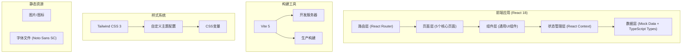
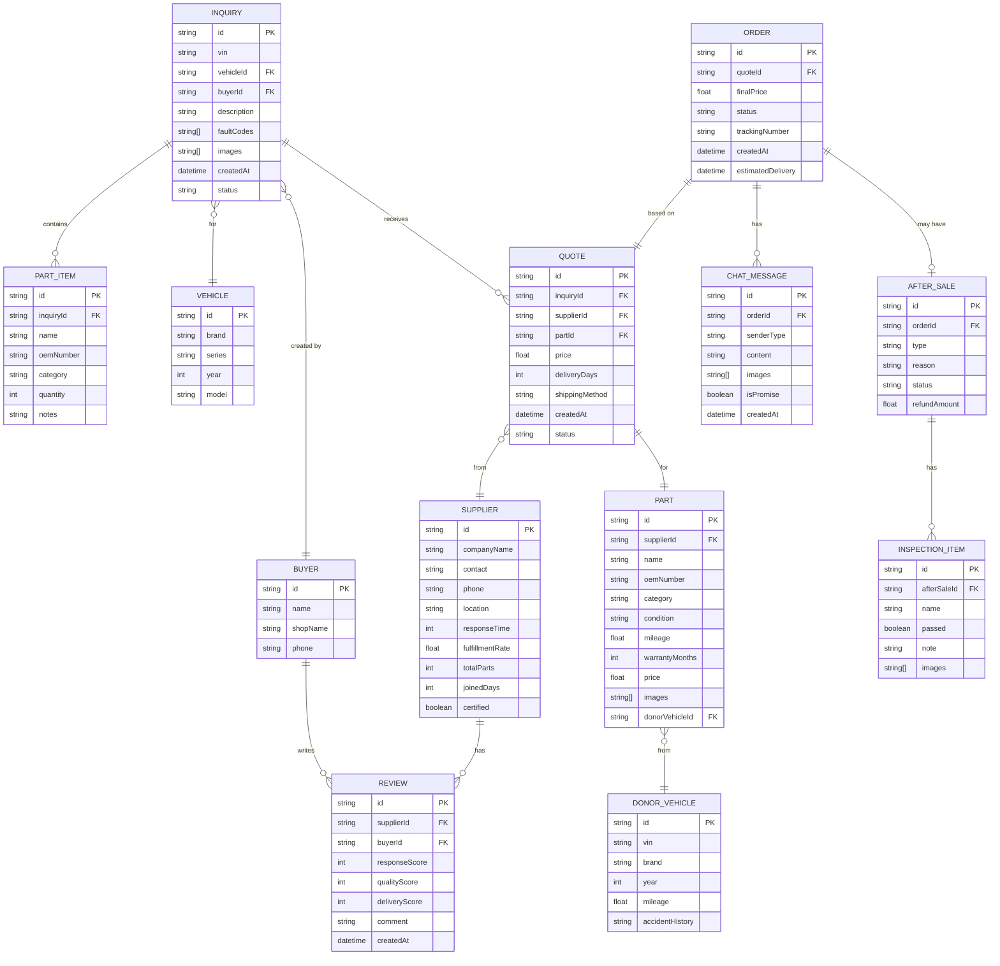

## 1. 架构设计



## 2. 技术描述

- **前端框架**: React@18.2.0 + TypeScript@5.4.0
- **构建工具**: Vite@5.2.0
- **样式方案**: Tailwind CSS@3.4.3 + PostCSS@8.4.38
- **路由管理**: React Router DOM@6.22.3
- **图标库**: Lucide React@0.363.0
- **数据管理**: React Context + Mock Data (JSON格式)
- **字体**: Noto Sans SC (Google Fonts)

## 3. 目录结构

```
src/
├── pages/                  # 页面层
│   ├── InquiryPage.tsx     # 询价单页面
│   ├── PartsHallPage.tsx   # 件源大厅页面
│   ├── SupplierPage.tsx    # 供应商页面
│   ├── OrdersPage.tsx      # 订单页面
│   └── AfterSalesPage.tsx  # 售后页面
├── components/             # 通用组件
│   ├── Layout/             # 布局组件
│   │   ├── Header.tsx
│   │   ├── Sidebar.tsx
│   │   └── PageContainer.tsx
│   ├── common/             # 基础UI组件
│   │   ├── Button.tsx
│   │   ├── Input.tsx
│   │   ├── Select.tsx
│   │   ├── Card.tsx
│   │   ├── Modal.tsx
│   │   ├── Table.tsx
│   │   ├── Tabs.tsx
│   │   ├── Upload.tsx
│   │   └── ImageViewer.tsx
│   └── business/           # 业务组件
│       ├── VehicleSelector.tsx
│       ├── PartsCategory.tsx
│       ├── QuoteCard.tsx
│       ├── ComparePanel.tsx
│       ├── OrderCard.tsx
│       ├── ChatPanel.tsx
│       ├── InspectionList.tsx
│       └── Timeline.tsx
├── context/                # 状态管理
│   └── AppContext.tsx
├── data/                   # Mock数据
│   ├── mockVehicles.ts
│   ├── mockSuppliers.ts
│   ├── mockParts.ts
│   ├── mockOrders.ts
│   └── mockAfterSales.ts
├── types/                  # TypeScript类型定义
│   ├── index.ts
│   ├── vehicle.ts
│   ├── supplier.ts
│   ├── parts.ts
│   ├── order.ts
│   └── aftersale.ts
├── utils/                  # 工具函数
│   ├── format.ts
│   ├── validate.ts
│   └── price.ts
├── App.tsx
├── main.tsx
└── index.css
```

## 4. 路由定义

| Route | 页面 | 说明 |
|-------|------|------|
| `/` | 询价单页面 | 首页，发起询价入口 |
| `/inquiry` | 询价单页面 | 发起询价、车型选择、需求拆分 |
| `/parts-hall` | 件源大厅页面 | 报价对比、筛选、议价 |
| `/supplier/:id` | 供应商页面 | 供应商详情、件源、评价 |
| `/orders` | 订单页面 | 订单列表、聊天、物流 |
| `/after-sales` | 售后页面 | 核验、退换、评价 |

## 5. 数据模型

### 5.1 ER图



### 5.2 核心类型定义

```typescript
// 配件成色
type PartCondition = 'new' | 'used' | 'remanufactured';

// 配件分类
type PartCategory = 'engine' | 'body' | 'electrical' | 'chassis' | 'transmission' | 'other';

// 订单状态
type OrderStatus = 'pending_payment' | 'pending_shipment' | 'shipped' | 'delivered' | 'completed' | 'after_sale';

// 售后状态
type AfterSaleStatus = 'pending' | 'processing' | 'accepted' | 'rejected' | 'completed';

// 询价单
interface Inquiry {
  id: string;
  vin: string;
  vehicle: Vehicle;
  buyer: Buyer;
  description: string;
  faultCodes: string[];
  images: string[];
  partItems: PartItem[];
  createdAt: Date;
  status: 'draft' | 'sent' | 'quoted' | 'ordered';
}

// 报价单
interface Quote {
  id: string;
  inquiryId: string;
  supplier: Supplier;
  part: Part;
  price: number;
  originalPrice?: number;
  deliveryDays: number;
  shippingMethod: string;
  warrantyMonths: number;
  createdAt: Date;
  status: 'pending' | 'negotiating' | 'accepted' | 'rejected';
  negotiationHistory?: NegotiationRecord[];
}

// 议价记录
interface NegotiationRecord {
  id: string;
  initiator: 'buyer' | 'supplier';
  price: number;
  message: string;
  createdAt: Date;
}

// 订单
interface Order {
  id: string;
  quote: Quote;
  finalPrice: number;
  status: OrderStatus;
  trackingNumber?: string;
  trackingCompany?: string;
  estimatedDelivery: Date;
  actualDeliveryDate?: Date;
  priceAdjustments: PriceAdjustment[];
  chatMessages: ChatMessage[];
  createdAt: Date;
}

// 价格调整（补差）
interface PriceAdjustment {
  id: string;
  type: 'supplement' | 'refund';
  amount: number;
  reason: string;
  createdAt: Date;
}

// 聊天消息
interface ChatMessage {
  id: string;
  senderType: 'buyer' | 'supplier' | 'system';
  content: string;
  images: string[];
  isPromise: boolean;
  createdAt: Date;
}

// 售后记录
interface AfterSale {
  id: string;
  orderId: string;
  type: 'return' | 'exchange' | 'refund';
  reason: string;
  description: string;
  evidenceImages: string[];
  inspectionItems: InspectionItem[];
  status: AfterSaleStatus;
  refundAmount?: number;
  timeline: AfterSaleTimelineItem[];
  createdAt: Date;
}

// 核验项
interface InspectionItem {
  id: string;
  name: string;
  category: 'appearance' | 'interface' | 'function';
  passed: boolean | null;
  note: string;
  images: string[];
}
```

## 6. Mock 数据说明

项目使用完整的 Mock 数据模拟真实业务场景，包含：

- **车辆数据**: 20+ 款主流车型，覆盖德系、日系、国产
- **供应商数据**: 15+ 家拆车商，含资质、评分、履约率等
- **配件数据**: 100+ 条拆车件，含成色、里程、质保、实拍图
- **订单数据**: 30+ 条历史订单，覆盖各状态节点
- **售后数据**: 10+ 条售后案例，含核验、退换、退款流程

所有数据通过 TypeScript 类型约束，确保数据结构一致性。

## 7. 性能优化

- **代码分割**: 按页面路由懒加载
- **图片优化**: WebP 格式，懒加载，响应式尺寸
- **组件优化**: React.memo 包裹频繁渲染组件
- **状态优化**: Context 按需拆分，避免不必要重渲染
- **构建优化**: Vite 生产构建开启压缩、Tree Shaking
